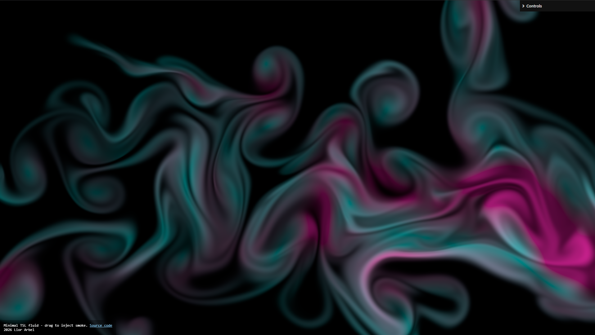

# Minimal TSL Fluid (WebGPU)

300 lines of code 2D smoke/fluid simulation using Three.js TSL compute kernels (no bundler).

[Try it live](https://liorarbel.github.io/minimal-fluid/)

- Ping pongs storage buffers
- [RK2](https://en.wikipedia.org/wiki/Runge%E2%80%93Kutta_methods) advection for velocity.
- Semi Lagrangian advection for smoke.
- Stores divergence each substep to reduce pressure solve reads.
- Solves pressure with Jacobi iterations, then projects velocity and applies pointer force.
- Warm starts pressure between substeps to converge faster with fewer iterations. This is critical when using such low pressure steps.
- Simulation resolution is fixed at startup; refresh after major window resize/orientation changes. Resize handling wasn't added to keep the code minimal.
- Optional stats: add `?stats=true` to the url.

